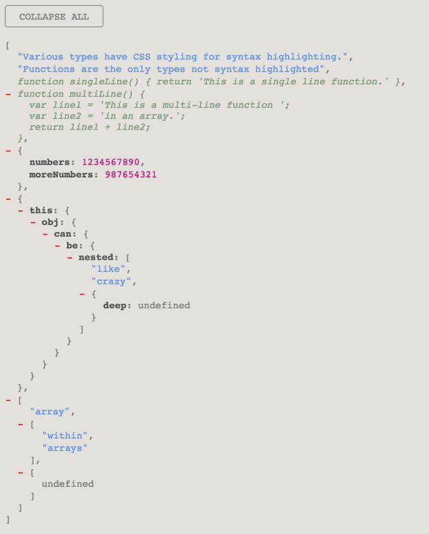

# Thing To HTML
Convert JavaScript objects and arrays to HTML!

`thingToHTML` will take an object or an array (no matter how deeply nested) and create an HTML structure on you're page that is collapsible at each level - similar to what the [JSONview](https://chrome.google.com/webstore/detail/jsonview/chklaanhfefbnpoihckbnefhakgolnmc?hl=en) plugin for Chrome does for JSON objects. Optionally, you can have it create a collapse / un-collapse all button at the top of the generated tree. Objects do not need to be JSON, meaning that double-quotes are not needed for everything (ugly!), and property values can be functions. There are two themes supplied, light & dark, for your syntax-viewing pleasure :).

[Live Preview](https://cdn.rawgit.com/qodesmith/thing-to-html/aa3ea23c6cc54f37f99fbb463983a45f6f40d45b/demo/index.html)

## Installation

### via NPM

`npm install thing-to-html`

Include `thing.css` in your page's `<head>`:

```html
<head>
  ...
  <link rel="stylesheet" href="node_modules/thing-to-html/thing.css">
</head>
```

Include `thingToHTML.js` just before your closing `<body>` tag:
```html
<body>
  ...
  <script src="node_modules/thing-to-html/thingToHTML.js"></script>
</body>
```

### Manually
Download `thing.css` and `thingToHTML.js`.

Include `thing.css` in your page's `<head>`:
```html
<head>
  ...
  <link rel="stylesheet" href="thing.css">
</head>
```

Include `thingToHTML.js` just before your closing `<body>` tag:
```html
<body>
  ...
  <script src="thingToHTML.js"></script>
</body>
```

## Usage
```javascript
thingToHTML({
  thing: <{an: object} OR [an, array]>,
  container: '.any-css-selector',
  button: true, // optional
  theme: 'dark' // optional - 'dark' or 'light'
});
```
`thingToHTML` takes an object as its only argument with 2 necessary properties (thing, container) and 2 optional properties (button, theme).

### thing
An object or an array. The fun starts when you have deeeeeeply nested objects & arrays.

`{some: 'Object'}` or `['some', 'array']`


### container
Any valid CSS selector as a string. `thingToHTML` will use `document.querySelector` to grab it.

Example selectors:

* `'.some-class'`
* `'#some-id'`
* `'body'`
* `'.some-class .in-another-class'`
* etc...

### button
This property is optional. Pass in `true` if you would like to generate the "Collapse / Un-Collapse All" button, omit it if not. The button will toggle all levels of your object to be open or closed.

### theme
This property is optional. There are two themes supplied in the CSS file: `'light'` and `'dark'`. Pass one in to get that theme (see examples below) or omit this property altogether for no styling. The themes will provide syntax highlighting for everything except functions.

## Examples

### Object example

```javascript
var myObject = {
  string: 'This is a string.',
  boolean: true,
  null: null,
  undefined: undefined,
  numbers: 1234567890,
  url: 'https://github.com/qodesmith',
  email: 'someone@example.com',
  array: ['one', 'two', 'three'],
  object: {property: 'value'},
  singleLineFxn: function() { return 'I am a single-line function!'; },
  multiLineFxn: function() {
    var x = ['Notice', 'how', 'your', 'indentation', 'is', 'preserved?'];
    x.map(function(word) {
      console.log(word);
    });

    return 'Awesome';
  },
  arrayOfObjects: [
    {arrays: 'can', be: 'nested'},
    {as: 'deep', as: ['you', {would: 'like'}]},
    {this: {reminds: {me: {of: 'Inception'}}}}
  ]
};

thingToHTML({
  thing: myObject,
  container: '#some-id',
  button: true,
  theme: 'dark'
});
```
This renders out on the screen like this (dark theme):

#### Open


#### Closed


### Array example

```javascript
var myArray = [
  'Various types have CSS styling for syntax highlighting.',
  'Functions are the only types not syntax highlighted',
  function singleLine() { return 'This is a single line function.' },
  function multiLine() {
    var line1 = 'This is a multi-line function ';
    var line2 = 'in an array.';
    return line1 + line2;
  },
  {numbers: 1234567890, moreNumbers: 0987654321},
  {this: {obj: {can: {be: {nested: ['like', 'crazy', {deep: undefined}]}}}}},
  ['array', ['within', 'arrays'], ['within' ['more', 'arrays']]]
];

thingToHTML({
  thing: myArray,
  container: '.some-class',
  button: true,
  theme: 'light'
});
```

This renders out on the screen like this (dark theme):

#### Open


#### Closed


### Contact

[Questions][1]? [Comments][3]? [Issues][1]? [Feature requests][2]?

I'm all ears...

[1]: https://github.com/qodesmith/thing-to-html/issues
[3]: https://github.com/qodesmith/thing-to-html/pulls
[2]: http://twitter.com/qodesmith